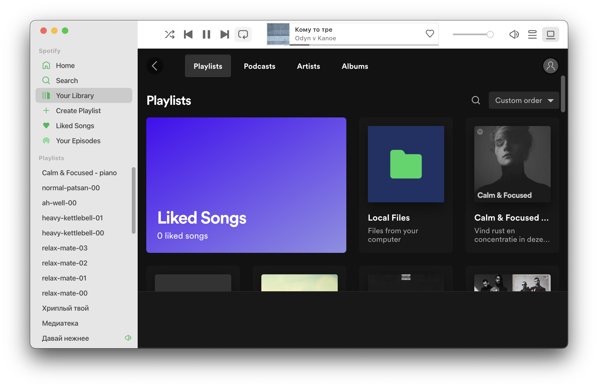

# Pseudonative Spotify

If take off glasses and cover eyes, it looks like something written in swift.

  
    Spotify v1.1.84.716.gc5f8b819
     
    Spicetify v2.9.7
     
    psfy v0.1.0
  

## Motivation

MacOS has its own design system, and when some company or person builds an apps using non-native tools (e.g. electron), it looks foreign. There are two options to make the app better: complete rewrite using native tools or in vain to try to modify an existing. I would like to follow the first option, but it will take too long. Therefore, your attention is presented to the app, which consists of a set of styles and scripts for simulating the interface familiar to us.

## License

[MIT](LICENSE).
